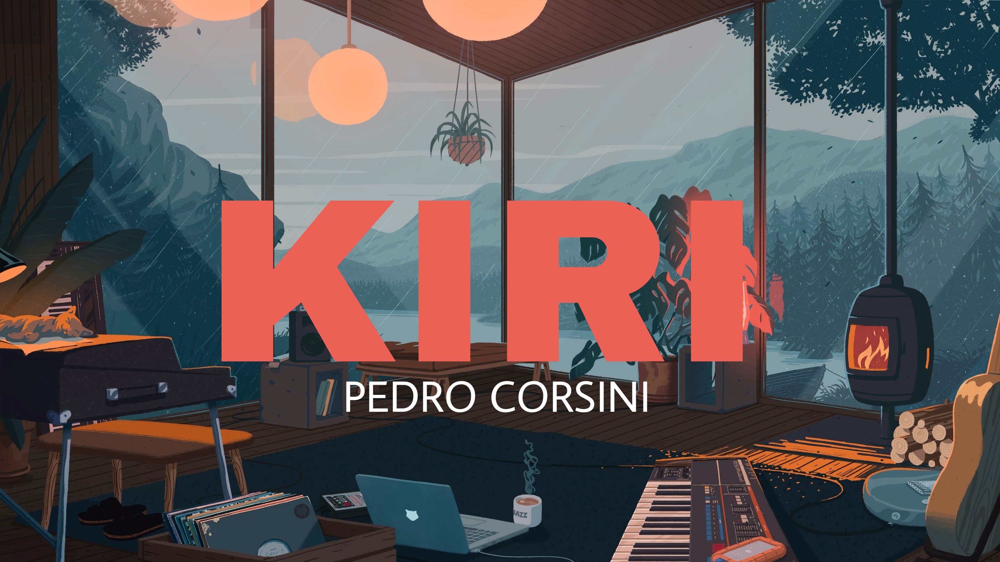

# Hello there! ✨ My name is Pedro Corsini, also known as Kiri. :)

> I'm a brazilian guy, new to this developer world. Hope you enjoy my little profile. ❤️

## 🎓 Some of my basic knowledges:

> Actually I'm new to Visual Studio Code, Node.js, and Discord Bots.

## 📜 My GitHub information:

## 📫 How to reach me: 

<!--
**pedrocorsini/pedrocorsini** is a ✨ _special_ ✨ repository because its `README.md` (this file) appears on your GitHub profile.

Here are some ideas to get you started:

- 🔭 I’m currently working on ...
- 🌱 I’m currently learning ...
- 👯 I’m looking to collaborate on ...
- 🤔 I’m looking for help with ...
- 💬 Ask me about ...
- 📫 How to reach me: ...
- 😄 Pronouns: ...
- ⚡ Fun fact: ...
-->
